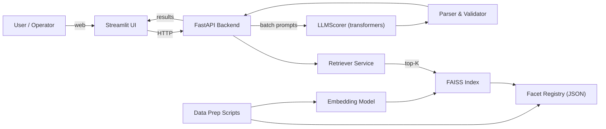
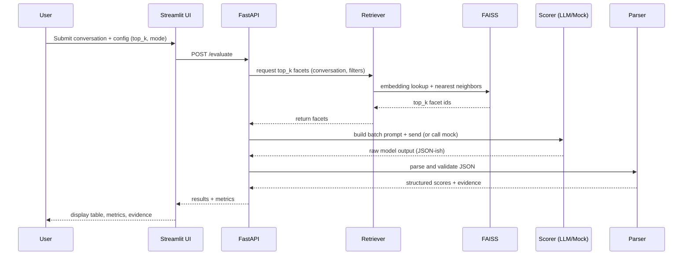
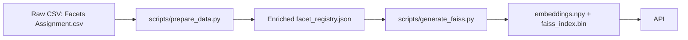

# Architecture & Diagrams — Conversation Evaluation Platform

This document describes the architecture, data flow, and operational guidance for the Conversation Evaluation Platform. It is intended as a reference for developers, operators, and reviewers. You can convert this markdown to PDF with your preferred tool (VS Code -> Print to PDF, `pandoc`, or `md-to-pdf` for mermaid support).

---

## Overview

The system evaluates free-form conversations against a large catalog of facets (behavioral/semantic checks). Key design goals:

- Treat facets as data (single source-of-truth JSON/CSV) to make the platform extensible by non-developers.
- Use retrieval (embeddings + FAISS) to limit LLM scoring to relevant facets.
- Batch facets into single LLM requests to reduce inference cost and improve throughput.
- Provide deterministic demo mode (`MOCK_MODE`) for reproducible outputs.

## High-level architecture



### Notes on components

- Streamlit UI (`streamlit_ui/app.py`): user-facing evaluation form, metrics panel, and results display. Calls `/evaluate` on the API.
- FastAPI Backend (`app/api/main.py`): orchestrates retrieval and scoring. Exposes endpoints `/evaluate`, `/facets`, `/health`, and `/facets/search`.
- Retriever (`app/services/retriever.py`): looks up top-K facets using FAISS or text fallback.
- FAISS Index & Embedding code (`scripts/generate_faiss.py` and `app/retrieval/*`): precomputes embeddings (sentence-transformers) and builds the FAISS index.
- Facet Registry (`data/processed/facet_registry.json`): enriched metadata per facet: `facet_id`, `facet_name`, `category`, `subcategory`, `description`, `inferability`, `evidence_type`, etc.
- Scoring (`app/scoring/scorer.py`, `app/scoring/prompt_builder.py`): supports `MockScorer` (deterministic) and `LLMScorer` (batch scoring). Uses lazy model load and graceful fallbacks.
- Parser (`app/scoring/parser.py`): robust JSON extraction from noisy model output, Pydantic validation, and extraction of `evidence` arrays.

---

## Evaluation sequence (detailed)



---

## Data pipeline



### Facet data model (example)

```json
{
  "facet_id": 12,
  "facet_name": "Sleep Problems",
  "category": "Sleep",
  "subcategory": "Insomnia",
  "description": "User reports difficulty falling or staying asleep.",
  "inferability": "high",
  "evidence_type": "sentence",
  "example_prompts": ["..." ]
}
```

---

## Parsing & Output format

Each scored facet returns a JSON object containing at minimum:

- `facet_id` (int)
- `score` (1-5 integer)
- `confidence` (float 0.0–1.0)
- `reason` (string brief rationale)
- `evidence` (optional array of text spans supporting the score)

The parser attempts to sanitize and extract these fields from model output robustly and falls back to safe defaults when parsing fails.

---

## Production considerations & scaling

- LLMs: large local models require GPUs and memory. Consider vLLM, LLM-as-a-service, or smaller distilled models for cost-effective production.
- Batch scoring: tune `SCORER_BATCH_SIZE` to balance prompt size vs model throughput.
- FAISS: if dataset grows, consider sharding, HNSW indexing, or using a managed vector DB (e.g., Weaviate, Pinecone, Milvus).
- Caching: cache embeddings for repeated facets and cache recent inference results for identical conversation inputs.
- Concurrency: run the FastAPI backend with multiple workers (Uvicorn/Gunicorn) and ensure model access is serialized or served via a dedicated inference service.

---

## Observability & monitoring

- Add structured logs for requests, retrieved facet ids, prompt sizes, model durations, and parse errors.
- Export metrics to Prometheus (inference time, parse failures, average confidence) and instrument dashboards.

---

## Security & privacy

- Data handling: conversations may be sensitive. Ensure encryption in transit (TLS) and at-rest controls for any saved transcripts.
- Access controls: protect API endpoints with authentication for production.
- Model policy: ensure any LLM usage complies with license and data-use policies.

---

## Deployment options & links (examples)

- Docker Compose (simple): `docker-compose.yml` in repo — run `docker-compose up --build`.
- Kubernetes: build container images and deploy with standard manifests or Helm.
- Streamlit Cloud: serve the UI alone if you prefer a hosted front-end and point `API_URL` to your backend.

Replace the example links with your actual deployment URLs:

- Docker Hub image: `https://hub.docker.com/r/your-org/conversation-eval`
- GitHub Actions pipeline: `https://github.com/your-org/conversation-eval/actions`
- Kubernetes manifests: `https://github.com/your-org/conversation-eval/deploy/k8s`

---

## How to convert to PDF

- VS Code: open the markdown file and use Print/Save to PDF from the Markdown preview.
- Pandoc: `pandoc ARCHITECTURE.md -o ARCHITECTURE.pdf` (mermaid will not be rendered as images automatically).
- For mermaid diagrams, use `md-to-pdf` (Node) or tools that support mermaid to image conversion, or export the diagrams separately and include them in a final PDF.

---

## Appendix: decisions and tradeoffs

- Facets-as-data enables non-dev edits and traceability, but requires careful schema design and versioning.
- Retrieval-first reduces token costs but depends on embedding quality and FAISS recall.
- Mock mode is invaluable for deterministic tests and demos, but must be disabled for production evaluation.

---

If you'd like, I can also export this file to PDF for you, or generate presentation slides (Markdown -> PowerPoint) summarizing the architecture.
